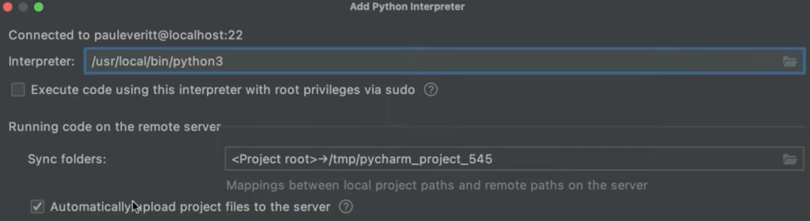
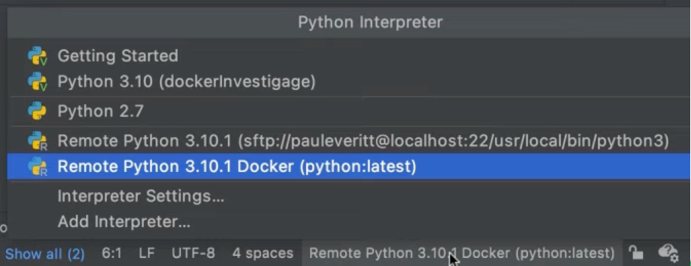
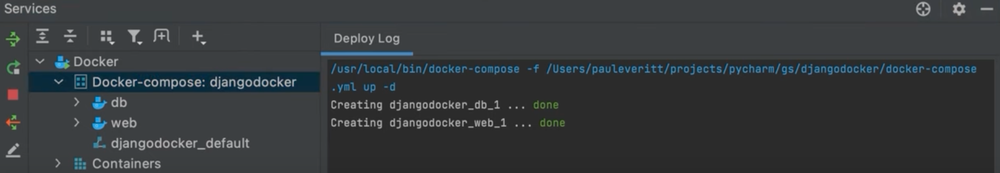

We just looked at configuring a local interpreter. But we don’t always have a “local” environment. Sometimes – and increasingly often – our environment is *over there*.

Let's learn how to configure remote interpreters – SSH, Docker, Docker Compose, WSL, etc. in PyCharm Professional.

## New Interpreter
As discussed in the previous step, to run your Python code you’ll need to configure at least one Python interpreter. In this step, we’re going to cover technologies for remote interpreters.

For all of these options, make sure you have Python downloaded and installed on your machine, as well as the technology you want to use. 

To setup a remote Python interpreter, you can either:
- Click the Python Interpreter widget in the Status Bar and choose ‘Add Interpreter’.
- Go directly to the **Add Interpreter** screen in our Settings/Preferences (**⌘,** | **Ctrl+Alt+S**) then click the gear icon and select **Add**.

Support for remote interpreters is part of PyCharm Professional’s offering. If you haven’t yet, I encourage you to try it now. [It has a free 30-day trial](https://www.jetbrains.com/pycharm/download/).

## SSH
Let’s start with remote interpreters using SSH. From the Add Python Interpreter dialog, click **SSH Interpreter**. You need to choose to either configure a new server or select an existing one. To configure a new server, select **New server configuration** and specify the server information, including host, port, and username before you click **Next**.

Next, we are going to provide authentication options to establish the connection. You can choose to connect with a password or with a key pair. We will use a password, then click **Next**.

In the final step we’ll choose the path to the Python interpreter inside the target server and then configure the path mappings between the local project and the server. This is necessary because PyCharm needs a local copy of your source code to provide you with some advanced features such as code completion and project-wide refactorings.

When you are working on remote hosts, you are editing your files locally and synchronizing your files. By selecting the checkbox that enables the automatic upload of the local changes to the remote server, you ensure everything is always synced. You can click **Finish** when you're done.

You can now run this code, but remotely, over SSH. If you want to select an existing server, select **Existing server configuration** rather than **New server configuration** and click the drop-down to select your server.

## Docker
Another way you can configure a remote interpreter in PyCharm is with Docker containers. Docker also requires some pre-configuration, so, in order to follow the next steps make sure that you have Docker installed.

In your Preferences/Settings (**⌘** | **Ctrl+Alt+S**) search for *docker* and select *Docker for <your OS here>*. It is under **Build, Execution, Deployment > Docker**.

For this example, I have already created a PyCharm project called *QuadraticEquation* and added a file called `solver.py`. The project has a local interpreter configured inside a virtual environment. Let’s configure a Docker-based remote interpreter for this project.

Click **Add interpreter** to display the Add Python Interpreter dialog and select *Docker* as the server, and add *Python:latest* as the Image name.

You can leave the Python interpreter path as is, and click **OK**. If you check the interpreter in the status bar, you will see that you are currently using your remote Docker-based interpreter in this project.

Now it’s time to run our code inside the container. To do that, click the gutter icon and select **Run Solver**. The script will be launched in the Run tool window, and here you can see the container ID where it is running. If you want to double-check it, go to the Services tool window, expand the *Containers* node, click **Properties** and here you can check the Container ID.

## Docker Compose
If you like to run multiple containers instead of one at a time, you could use Docker compose to configure remote Python interpreters in PyCharm.

In this example we are going to use a Django application with a PostgreSQL database running in a separate container. Let's start by cloning the project from GitHub. In this example we created two containers, one for the database and one for the application, and have Docker Compose linking them together.

This repository already has a `Dockerfile` and a `docker-compose.yml` file. We are creating two services, one web and one database. With these files in place we can start configuring Docker Compose. 

In your Preferences/Settings (**⌘** | **Ctrl+Alt+S**) search for *docker* and select *Docker for <your OS here>*. It should be under **Build, Execution, Deployment > Docker**. It might already be configured from the earlier step. On your Status Bar click the current interpreter name and select **Add Interpreter** then select *Docker Compose* from the list.

For the server, select “Docker”. The configuration file is the `docker-compose.yml` file we created earlier. Service is the entry service declared inside your `docker-compose` file. In this case, we will use our web service. All other containers in the compose file will be started together with this one as if you started them with the command `docker-compose up` from the command line. In this case we will not configure any environmental variables or change the Python interpreter path.

PyCharm will now set up the remote interpreter. You can open up your docker-compose file and click the double **play** button next to services to launch your services using Docker Compose. You can now see your services in the Services tool window.

Our settings file tells Django how to connect to the PostgreSQL server running in the “db” Docker Compose service. Now we can run the whole application under Docker Compose. First we can run any pending migrations then let's edit the run configurations for this project from the **Run Configuration** drop down and then **Edit configurations**.

We need to update our ‘HOST’ to 0.0.0.0 and click **OK**.

To run it click the **play** button, wait until everything is launched, and then click the link to open it in the default browser. That’s it, we configured a set of services to run under Docker Compose, integrated into the IDE’s tooling, then successfully launched our app.

## WSL
the last way to configure a remote interpreter in PyCharm is using the Windows subsystem for Linux - WSL. This is available for Windows users-only.

First, you need to do some prep from your side. Make sure you have Python installed on your computer and install the Windows Subsystem for Linux and initialize your Linux distribution. You also need to ensure that you have *rsync* installed.

We’ll add a Python interpreter based on WSL. Let's click the Project interpreter in your Status Bar again and select **Add interpreter**.

In the Add Interpreter dialog, select WSL from the list. Let's select the Linux distribution, and specify the path to the Python executable inside the distribution you selected. As a note, PyCharm currently can’t manage virtual environments inside WSL, so packages will be installed into this interpreter.

Click **OK** and PyCharm will add the interpreter to the project and set the path mappings. When working in WSL it’s also good to configure your terminal in WSL. You can do this from your Preferences/Settings (**⌘** | **Ctrl+Alt+S**) by searching for *terminal* under **Tools > Terminal**.

Select the subsystem path from the dropdown in the *Shell path* field and click **OK**. Type *wsl.exe* in the Shell path field and click **OK**. You now have a WSL-based Python environment and interpreter to use for this project, just like our other kinds of interpreters.

## Conclusion
And that’s it for configuring remote interpreters in PyCharm Professional!

In the next step, we’ll see how to install and manage Python packages in PyCharm.

## Video
You can also check out the video for this step from our Getting Started series on YouTube: