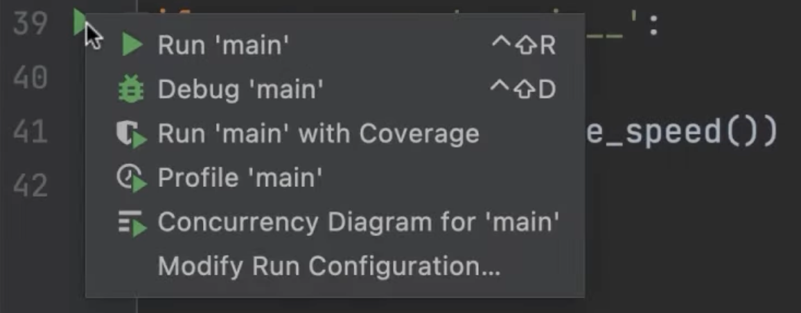
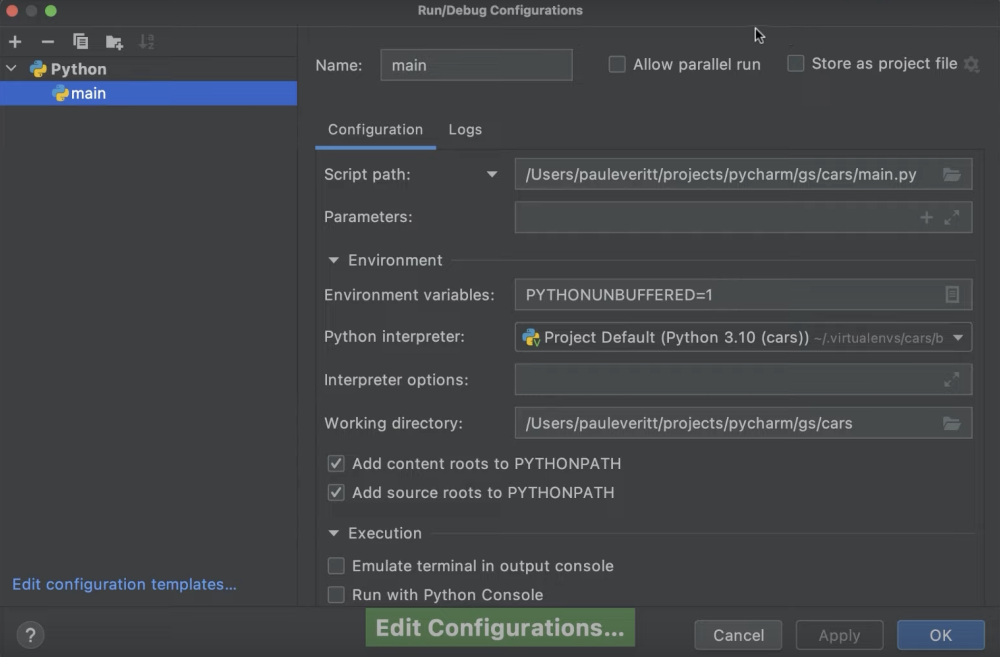

In the previous step, we saw how PyCharm makes coding productive.

In this step, we are going to talk about run configurations and how PyCharm helps you to run your Python code.

## Temporary Run Configurations
First off, let’s talk about temporary Run Configurations. If you haven't run your pure Python script yet, PyCharm will give you a drop-down that says **Add Configuration**. This means that PyCharm doesn’t know how to run this script yet.

To run your script, you can right-click anywhere inside the editor and click **Run script name**. PyCharm will create a Run Configuration, run the script, and display the output inside the Run tool window. The Run tool window is useful to see your output, as well as more comprehensive error messages if the Python interpreter finds an error in your program.

The temporary Run Configuration created by PyCharm is now available in the top bar and can now be reused every time you want to run this script again with the *Play* button.

Alternatively If we scroll down, we can see that we have an `if __name__ == '__main__'` block and it has a *play* icon in the gutter. This is another shortcut to create a temporary run configuration. When you click it, a context menu shows up, and the first option says **Run <name of your script>**.

Using the *Play* button will also create a temporary Run Configuration as well as displaying the output inside the Run tool window.

## Configurations From Project Templates
Let’s now look at explicitly creating a Run Configuration. The previous scenario applies for both PyCharm Community and PyCharm Professional, but this option is only available for PyCharm Professional.

Let's work with an empty Django project. Although we haven’t done anything yet, we can see that the Run Configurations button already shows the project name and a ‘Django’ logo. This is because PyCharm professional has already created a basic run configuration, special for Django.

When we click the *play* button, PyCharm launchs the Django project, including a webserver, so you can click the link in the Run tool window and see your Django project up.

PyCharm Professional also creates configurations for your Flask projects, FastAPI projects, and projects based on other frameworks.

## Permanent Run Configurations
Many times in your development workflow you will need to configure different startup points for your application, including, for example, executing your script with different Python interpreters. This is when your permanent Run Configurations come in handy.

The easiest way to do it is by transforming a temporary Run Configuration into a permanent one by clicking the drop-down menu and selecting **Save project name Configuration**.

You can also use pre-configured templates to create your Run Configurations by opening the **Edit configurations** dialog and clicking on the **plus** button. You can then choose the target you are creating Run Configurations for. Each template has specific fields that are necessary for configuring different targets.

## Conclusion
We saw how to quickly run our Python scripts with temporary run configurations, and why sometimes it will be handy to create permanent ones.

In the next step, we’ll talk about basic code refactoring in PyCharm.
