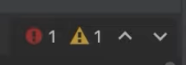

In the previous step, we looked at starting a project, which means we had PyCharm open and looked at the IDE.

Gosh, there’s a lot on the screen. How is this UI laid out? What do each of the parts do?

## The Editor
When a file is open, it appears in a tab in the editor. When you double-click another file another tab opens. As you can imagine you can close and organize them individually, in many ways.

Inside the editor, on the right-hand side, you can see the inspection widget, which you can use to view all the problems in the current file and navigate between each issue. 

You can also see errors and warnings in the scrollbars. In the left-hand side of the editor, the gutter shows your line numbers, icons and allows you to perform several actions such as adding or removing breakpoints by clicking the gutter.

You can right-click anywhere in the editor pane to invoke the context menu, which shows the list of actions available in the current context. For some actions, you’ll get popups that let you click through to perform an action. At the bottom of the editor pane, you can also see breadcrumbs. These show the names of the classes, variables, functions, methods, and tags in the file that is currently open. You can use these to navigate quickly through the source code.

## Tool Windows
The IDE wants to help you with your coding and to integrate your other development workflows. It does this with tool windows which all serve a specific purpose. The Project tool window (**⌘1** + | **Alt+1**) is open by default in the left and shows the file layout of your project.

The Terminal tool window lets you work with the built-in terminal. The Python Packages tool window lets you manage packages from *Pypi* and other repositories within the context of your virtual environment.

The Python Console tool window is an interactive Python console that lets you execute Python commands and scripts line by line, in the context of your project interpreter. It’s good for exploration.

At the very bottom of the IDE, you can find the Status Bar. It’s a small yet very handy piece of the UI. First, the quick access button. It lets you quickly switch between the tool windows and allows you to hide and show the tool window bar. The right hand side of the status bar contains several useful status bar widgets including the project settings, version control information and your project interpreter setup.

At the top, you can also find your Navigation Bar. This serves as a quick alternative to the Project tool window, for moving around directories and performing file operations.

You can also use the buttons that are to the right of the Navigation Bar to quickly perform some common actions, like running or debugging an app, updating a project or making a commit, running a search, and the like. Note that the toolbar might look different if your project isn’t under version control.

This part of the UI also gives you access to Code With Me, PyCharm’s built-in functionality for collaborative development. From here you can enable access for guests and start collaborative sessions. 

Finally, right above the Navigation bar, you’ll find the main menu. It has various actions and controls, including the Preferences/Settings and Help.

## Conclusion
In this step we went through the basics of PyCharm’s UI elements.  

In the next step, we are going to see how to customize the UI and some settings to suit your personal or team needs.

## Video
You can also check out the video for this step from our Getting Started series on YouTube:
